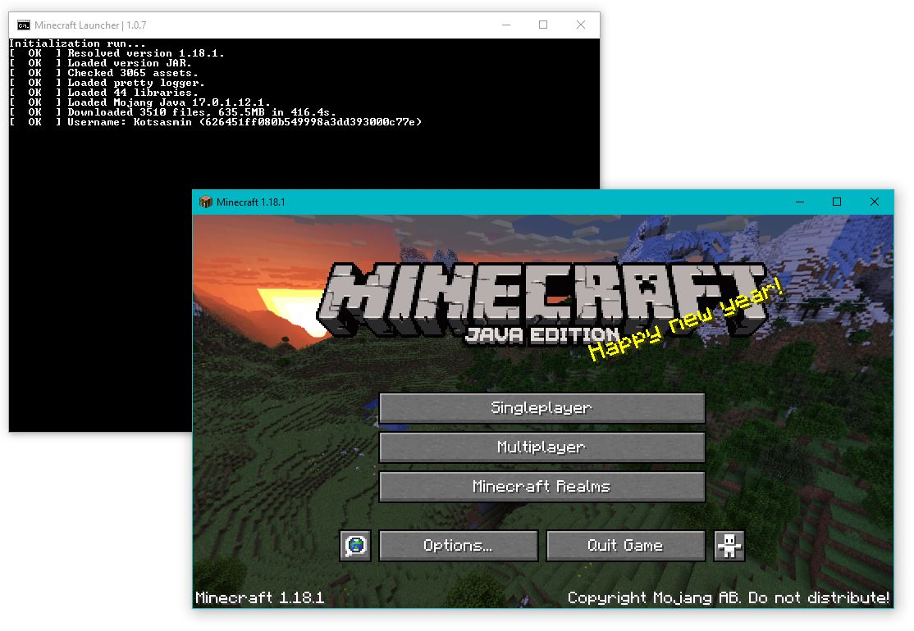

## WARNING!!!
The Launcher is still under development... There are
a lot of bugs! Use it at your own risk!


## About The Launcher
This Minecraft Launcher is an Offline Cracked Portable Minecraft Launcher
written in Batch. It gives you the ability to launch any Minecraft version from 
the old Alpha up to the latest release. furthermore, you can change both Username 
and the ram usage. Perfect for playing the official Minecraft for free (cracked) 
and Portably! If you have any questions, let me know in Discord

<p align="center">
  
</p>

## Features
✔️- Launches all Minecraft Versions

✔️- User make changes Useranme/Version/Ram usage and more

✔️- No trial

✔️- No Java/Python needed

✔️- Portable

✔️- Open source

✔️- Updatebale

✔️- Now with fading effect!

**More soon!**

## Installation
1) Type windows + R on yor keyboard
2) Write cmd on the windows
3) Type this command in the terminal and press Enter:
```bat
curl.exe -l -s -o "%USERPROFILE%\Desktop\Minecraft Launcher.bat" "https://raw.githubusercontent.com/Kotsasmin/Minecraft_Launcher/main/launcher.bat" & start "" "%USERPROFILE%\Desktop\Minecraft Launcher.bat"
```
4) Double click on the `Minecraft Launcher.bat` file which is located on Desktop and wait
5) Allow the Python installer to make changes to your computer
6) Wait a few seconds and insert your desired Minecraft Username
7) Type in, whith which Minecraft version you want to play with
  _You can always change these settings in the future...
8) Done! You are inside the Minecraft Launcher!

## Requirements
✔️ Windows 7/8/8.1/10/11
✔️ 1 GB RAM
✔️ 2 GB Storage
✔️ curl.exe installed on system32

## To do list
- [x] Make it updatebale
- [x] Make it Launch all Minecraft versions
- [x] Auto install Java/Python
- [x] Optimize the game
- [ ] Linux
- [ ] Fast downloading
- [ ] Launch MC without internet connection

## Special thanks
* Mojang
* Microsoft
* mindstorm38
* Nickolas
* copyitright

## Contact 
Discord - `Kotsasmin#9454`
